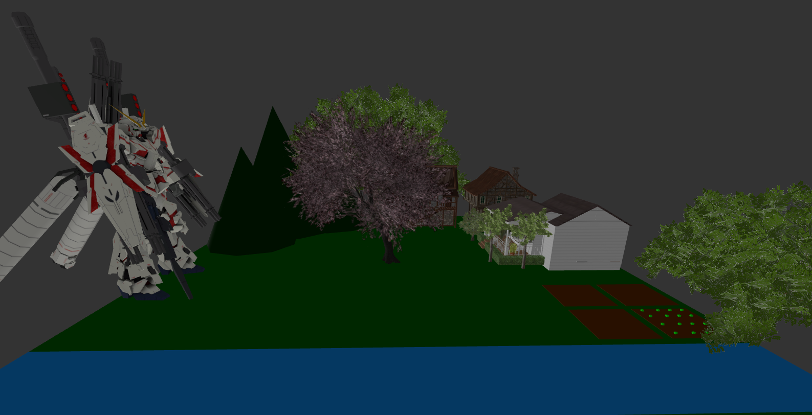

# Assignment 02 : 3D graphic (Three.js)

> **เป้าหมาย:** วาดภาพทิวทัศน์ด้วย **HTML5 JavaScript Three.js** ตามที่เรียนใน Week04–Week05 โดยใช้ model จากไฟล์ glTF/glb ได้ (เช่น ต้นไม้/บ้าน)

---

## สรุปงาน
  1) ภูเขา 
  2) พระอาทิตย์ 
  3) ท้องนา 
  4) ต้นไม้ 
  5) บ้าน/กระท่อม 
  6) แม่น้ำ 

  ---

> แรงบันดาลใจ: จากหัว ที่คิดอยากมีหุ่นและบ้าน
>  

---

## วิธีรันงาน (เลือกอย่างใดอย่างหนึ่ง)
**วิธีที่ 2 (แนะนำใน VS Code):** ติดตั้งส่วนเสริม *Live Server* → คลิกขวา `index.html` → *Open with Live Server*

---

## เกณฑ์ให้คะแนน (100 คะแนน + โบนัส 20)
- **ครบ 6 องค์ประกอบ** — 40 คะแนน  
- **ใช้ Three.js ตามที่เรียน** (mesh/scene/camera ฯลฯ) — 20 คะแนน  
- **องค์ประกอบภาพ/ความเป็นระเบียบ** — 15 คะแนน  
- **โครงสร้างโค้ดดี** (แยกฟังก์ชัน/อ่านง่าย/มีคอมเมนต์พอดี) — 15 คะแนน  
- **README มีคุณภาพ** (วิธีรัน/แนวคิด/ลิงก์วิดีโอ) — 5 คะแนน  
- **วิดีโออธิบาย ≥ 5 นาที** (ครบหัวข้อ) — 10 คะแนน  
- **โบนัสแอนิเมชันสมเหตุผล** — 0–20 คะแนน (เมฆลอย, แสงเปลี่ยน, น้ำไหล ฯลฯ)

---

## วิดีโออธิบาย (≥ 5 นาที ต้องมี)
1) แนะนำตัวสั้น ๆ  
2) โชว์ผลลัพธ์ที่รันจริง  
3) อธิบายลำดับโค้ดส่วนสำคัญ → ผลที่เกิด  
4) แก้โค้ดเล็กน้อยแล้วโชว์ผลต่าง (เช่น เปลี่ยนสี/ตำแหน่ง/ความเร็วเมฆ)  
5) สรุปสิ่งที่เข้าใจ/ทักษะที่ได้

> ลิงก์วิดีโอ:(  )

---

## เช็กลิสต์ก่อนส่ง
- [ ] มีองค์ประกอบครบทั้ง 6 อย่าง  
- [ ] โค้ดรันได้จริง (เปิดหน้าเว็บแล้วเห็นภาพครบ)  
- [ ] โครงสร้างโค้ดอ่านง่าย แยกฟังก์ชันพอเหมาะ มีคอมเมนต์สั้น ๆ  
- [ ] README ระบุวิธีรัน + ใส่ลิงก์วิดีโออธิบาย  
- [ ] วิดีโอ ≥ 5 นาที และมี “แก้โค้ดแล้วผลต่าง” ให้เห็นชัด

---

**สนุกมากคับทั้งวาดทั้งอัปโมเดลเข้า แต่ผมติดกับเงา 2-3 วัน(สรุปไม่ได้)**